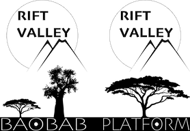
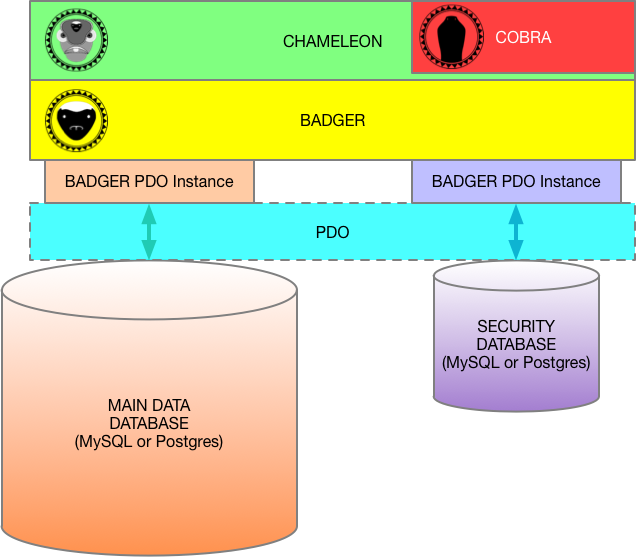

\page COBRA COBRA

COBRA
======

Part of the BAOBAB Server, which is part of the Rift Valley Platform
--------------------------------------------------------------------

INTRODUCTION
============
COBRA is a security administration toolset for the Rift Valley Platform (RVP).

It is a standalone class that is instantiated with a logged-in \ref CHAMELEON instance. That login needs to be an instance of `CO_Login_Manager` (or a subclass).

COBRA will allow a manager to create and delete logins, as well as manage security tokens.

\ref CHAMELEON is the "First Layer Abstraction" from the data storage and retrieval. It implements a few higher-level capabilities, such as collections, users and places.

\ref BADGER is the "First Layer Connection" to the data storage subsystem. It uses [PHP PDO](http://php.net/manual/en/book.pdo.php) to abstract from the databases, and provide SQL-injection protection through the use of [PHP PDO Prepared Statements](http://php.net/manual/en/pdo.prepared-statements.php).

DESCRIPTION
===========

COBRA is designed to be the "user manager" for The Rift Valley Platform. It is not required to run the RVP, and is not required for basic logins and control of general security access. That is handled by \ref BADGER and \ref CHAMELEON.

COBRA is required to create and manage logins and users.

NEW LOGIN CLASSES
-----------------

COBRA introduces `CO_Cobra_Login` and `CO_Login_Manager`, two specializations of `CO_Security_Login` (from \ref BADGER). These are available whether or not an instance of CO_Cobra is available.

`CO_Cobra_Login` describes your "standard" endpoint login.

`CO_Login_Manager` is a class for "managers." These are logins that can create and delete other logins.

If a `CO_Login_Manager` (or "God") deletes a login, the login is not actually removed from the database. Instead, it is converted to a security token.

TOKEN MANAGER
-------------

A `CO_Login_Manager` can use COBRA to create new security tokens (`CO_Security_ID` from \ref BADGER). These are security database rows that have no purpose, other than to fill a slot.

Once created, you cannot delete a security token.

TOKEN POOLS
-----------

COBRA `CO_Login_Manager` instances have "token pools." They are supplied (initially by the "God" login, but later, by other `CO_Login_Manager` instances) a "pool" of security tokens.

A `CO_Login_Manager` can also create new tokens, which it adds to its pool.

When a `CO_Login_Manager` creates another `CO_Login_Manager` or a `CO_Cobra_Login` instance, it can bestow a set of tokens to that new login from its pool. It cannot supply tokens outside of its pool.

IMPLEMENTATION
==============

You implement COBRA by first setting up \ref CHAMELEON (`CO_Chameleon`), then instantiating `CO_Cobra`, passing in an instance of `CO_Chameleon`, with a `CO_Login_Manager` logged in.

LICENSE
=======

© Copyright 2018, The Great Rift Valley Software Company

LICENSE:

MIT License

Permission is hereby granted, free of charge, to any person obtaining a copy of this software and associated documentation
files (the "Software"), to deal in the Software without restriction, including without limitation the rights to use, copy,
modify, merge, publish, distribute, sublicense, and/or sell copies of the Software, and to permit persons to whom the
Software is furnished to do so, subject to the following conditions:

The above copyright notice and this permission notice shall be included in all copies or substantial portions of the Software.

THE SOFTWARE IS PROVIDED "AS IS", WITHOUT WARRANTY OF ANY KIND, EXPRESS OR IMPLIED, INCLUDING BUT NOT LIMITED TO THE WARRANTIES
OF MERCHANTABILITY, FITNESS FOR A PARTICULAR PURPOSE AND NONINFRINGEMENT.
IN NO EVENT SHALL THE AUTHORS OR COPYRIGHT HOLDERS BE LIABLE FOR ANY CLAIM, DAMAGES OR OTHER LIABILITY, WHETHER IN AN ACTION OF
CONTRACT, TORT OR OTHERWISE, ARISING FROM, OUT OF OR IN CONNECTION WITH THE SOFTWARE OR THE USE OR OTHER DEALINGS IN THE SOFTWARE.

The Great Rift Valley Software Company: https://riftvalleysoftware.com
The Great Rift Valley Software Company: https://riftvalleysoftware.com
